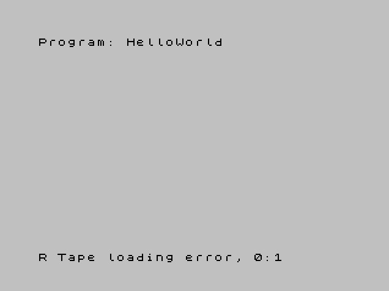

# Solutions

## 1. Run the audio in hardware/emulator:

If the creator of the audio has made it hardware/emulator compatible and added the parity byte, loading the audio will print the flag.

## 2. Explore the memory address in hardware/emulator:

If the creator of the audio has made it hardware/emulator compatible but hasn't added the parity byte, the flag won't print and the execution will be stucked.

The information is already on memory, so the flag can be found exploring the internal memory.

## 3. Seeing the waveform:

The data is in binary and in the Spectrum the bits are represented:

- 0 - As a short pulse.
- 1 - As a longer pulse.

A solution is to explore the waveform when the message starts and write down the ones and zeros, then convert them to ASCII.

---

I hope you have enoyed it! :)